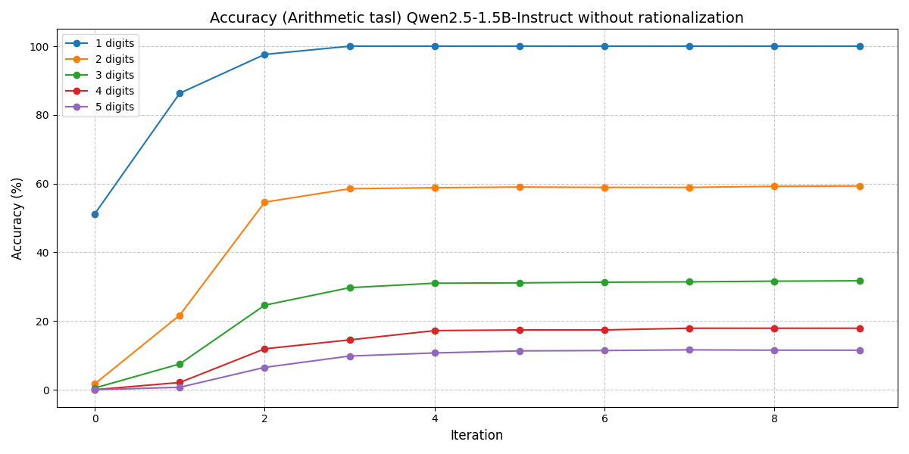

# Implementation of [Self-Taught Reasoner](https://arxiv.org/pdf/2203.14465)

## Implementation Details.
- This repo implmements the [STaR paper](https://arxiv.org/pdf/2203.14465) on the arithmetic task described in the paper.
- `arithmetic_dataset.py` generates the `num_samples` each of `num_digits`, bringing the total dataset size to `num_samples * num_digits`
- `star_trainer.py` contains the main implementation.
- For the results in [results section](#results), I used `num_digits = 5`, `num_samples = 1000` and `num_iterations = 10`
- To perform a rationalization step, add the `--do_rationalization` argument when running the star_trainer script.
- To log the accuracy plots at each iteration, add the `--accuracy_per_iter` argument when running the star_trainer script
- [Qwen/Qwen2.5-1.5B-Instruct](https://huggingface.co/Qwen/Qwen2.5-1.5B-Instruct) was used for training.
- Experiment was conducted on a single A100 80GB GPU.
- Assistants were [Grok](https://grok.com) and [Qwen](https://chat.qwenai.com/)

## Results. 
- STaR with rationalization

- STaR without rationalization

## To run the scripts

Run `python star_trainer.py --model_path "Qwen/Qwen2.5-1.5B-Instruct" --num_digits 5 --num_samples 1000 --num_iterations 10`